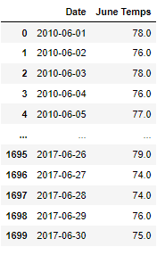
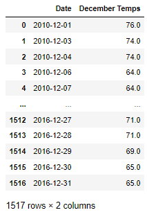
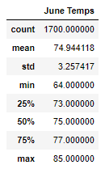
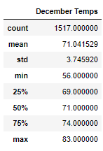

# SurfsUp Analysis

## Overall Summary
The purpose of this analysis was to gather the necessary data to establish the viability of a business on the island of Oahu.  In particular the client was curious to know what microclimates to expect in certain geographical locations on the island.  The analysis would provide more data to determine the specific location of the potential business opportunity.  The client specifically wanted the temperature data for the months of June and December to understand if a surf and ice cream shop would be a sustainable business opportunity on a year-round basis.

Here are the deliverables that were required from the client:
1. Provide temperature statistics for the month of June during the years 2010-2018
2. Provide temperature statistics for the month of December during the same years

As weather would play an important role in the determination of this particular business, the client was curious to see what the particular statistics were before making a determination to initiate this opportunity.  The data on Hawaii temperatures were gathered from a variety of different stations and presented here as a table of temperatures throughout the month of June in every year from 2010-2018.  As you can see in the table (see Figure1 below), June seems to be quite mild with temps in the mid to upper 70's.  Compared to the temperatures in December (see Figure2 below), the temps there seem to slightly dip to the mid 60's to mid 70's.

### Figure1

### Figure2

As we look at the statistical data June numbers (see Figure3 below) display again, a slightly warmer range of temps, measurements from the low of 64 to a high of 85, with the average at 74.  December stats (see Figure4 below) show a low of 56 and high of 83, with an average of 71.  

### Figure3

### Figure4

In conjunction with the historical weather data displayed here, it may be a good idea to tie other statistics regarding location of competitors, wave data, demographic and tourist foot traffic.  Tying that data together with weather would provide a better indication of where to pinpoint the location of the shop along with it's viability.

In conclusion, the weather data provided here can